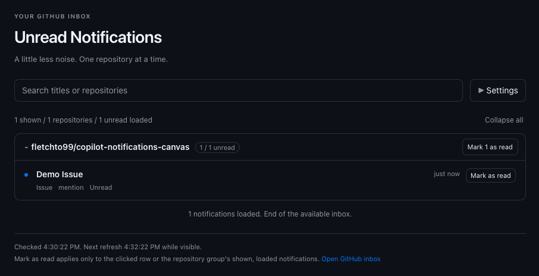

# Unread Notifications

Unread GitHub notifications in the GitHub Copilot app, grouped by repository.
Search, mark rows or repositories as read, and opt into desktop
notifications or auto-open.



## Prerequisites

- A GitHub Copilot app build with extension canvas support (experimental).
- Node.js 22 or later.
- [GitHub CLI](https://cli.github.com/) (`gh`) available to the app and signed
  into **github.com** with `notifications` or `repo` scope.

GitHub.com only; fine-grained personal access tokens are not supported.
Check sign-in with `gh auth status --hostname github.com`.

<a id="installation"></a>
<a id="updating"></a>

## Installation and Updating

### Install or update with Copilot

Use the same prompt for a fresh installation or an upgrade, including versions
that do not yet have an update banner:

```text
Install or update the Unread Notifications canvas from
https://github.com/fletchto99/copilot-notifications-canvas as a user-wide
GitHub Copilot extension available across sessions. Follow the repository's
manual steps under "Installation and Updating".

Use the latest published stable GitHub Release, not main or a prerelease.
If no stable release exists, stop and report that. If already current, report
that instead of reinstalling. Do not downgrade a newer installed version.

Read the release notes, fetch the exact release tag into a separate clean
checkout or worktree, and run node scripts/check-release.mjs <release-tag>
before node scripts/install.mjs. Use my existing COPILOT_HOME and GitHub CLI
sign-in.

Preserve the entire installed artifacts directory in place, including
settings.json, autoOpen, darkMode, unknown settings, and other files. Do not
delete or recreate that directory, overwrite locally modified runtime files,
or bypass installer safeguards. Report missing prerequisites or permissions
without changing credentials.

Only after installation succeeds, reload extensions in this session and
open Unread Notifications (canvasId: github-notifications). Report the
installed version and remind me to reload extensions in other already-open
sessions. Do not enable auto-update or change any preferences.
```

### Manual installation and updates

Both paths install user-wide into
`${COPILOT_HOME:-$HOME/.copilot}/extensions/github-notifications`.
Use the same `COPILOT_HOME` for an upgrade as for the original installation.

1. Read the [release notes](https://github.com/fletchto99/copilot-notifications-canvas/releases)
   and choose the latest stable `<release-tag>`. If no stable release is
   published yet, wait for the first release or use a development checkout
   explicitly.
2. Enter your existing repository clone. If you do not have one, create it
   in the directory where you keep repositories:

   ```sh
   git clone https://github.com/fletchto99/copilot-notifications-canvas
   cd copilot-notifications-canvas
   ```

3. From that clone, run the following with a **new, unused worktree path**.
   Set `COPILOT_HOME` first if you use a custom location:

   ```sh
   git fetch origin tag <release-tag>
   git worktree add --detach ../copilot-notifications-release <release-tag>
   cd ../copilot-notifications-release
   node scripts/check-release.mjs <release-tag>
   node scripts/install.mjs
   ```

4. Only after the installer succeeds, ask Copilot:

   > Reload extensions, then open the Unread Notifications canvas.

   Other already-open Copilot sessions need their own extension reload.

**Settings are preserved.** The installer writes a complete runtime, including
its HTML, JavaScript and styles, under `runtimes/<content-hash>/`, then atomically
switches the extension entry point to that version. It never replaces files
inside a published runtime. `.copilot-notifications-install.json` records the
active runtime; its `version.json` is authoritative, not any retained legacy
`version.json` at the extension root.

It leaves `artifacts/` in place, including `artifacts/settings.json`, unknown
settings, and other artifacts, even if a running session saves settings during
the update. Never delete the installed extension to upgrade it. If the installer
reports modified files, stop and preserve those changes; do not bypass its
ownership or concurrency safeguards.

Older runtimes are retained so already-open sessions keep a consistent version,
even if an upgrade rolls back. Upgrades from the original flat layout also keep
its legacy files, including `sound.mjs`, for sessions that have not reloaded.
These retained files are extension code, not notification content. They are not
automatically pruned; do not remove them while a session may still use them.
New runtimes contain no Web Audio playback or its old inbox activity tracking.

Updates use the user-wide installer. A project-local checkout shadows a
user-wide installation in that repository; update that checkout deliberately
instead of expecting a user-wide install to replace it. Persisted settings,
including **Auto-open**, **Dark mode**, **Desktop notifications** and
**Sound**, are retained.

## Usage

- Repository groups are always sorted alphabetically by full name (`owner/repo`),
  so marking notifications as read does not reorder the remaining groups.
  Notifications within each group remain newest first.
- The canvas loads up to 50 notifications initially. **Load more** fetches up to
  50 more at a time, with no fixed total cap while GitHub has more pages.
  Search covers loaded notifications only.
  The count shows loaded unread notifications, adds a matching count while
  searching, and disappears when you are all caught up. Search and Settings
  stay in place.
- Notifications refresh about every two minutes while the canvas is visible.
  GitHub polling and rate limits can delay updates. The footer shows relative
  check times; hover over the status for exact times and the visibility reminder.
- **Force refresh**, beside the checked time in the footer, checks loaded pages
  immediately without waiting for the polling
  interval. It stays clickable; clicks during an active operation queue one
  follow-up refresh. GitHub rate-limit and error retry waits still apply and
  are shown as errors.
- The inbox icon to the left of **Settings** opens your
  [GitHub inbox](https://github.com/notifications) in a new tab.
- The **Settings** gear icon includes matching **Dark mode**, **Auto-open**, and
  **Desktop notifications** switches. The canvas follows Copilot's theme until
  you choose light or dark; your choice is saved across sessions and loaded
  when a panel opens or becomes visible.
- **Auto-open** and **Desktop notifications** are off by default.
  **Sound** offers system-specific sounds
  and defaults to **System default**. These settings are saved across sessions.
  Desktop alerts run while the canvas is in the foreground, hidden, or
  Copilot is minimized, as long as its session's
  extension process is running. Closing the last Notifications canvas stops
  the watcher; quitting Copilot stops it too.
- Auto-open runs once per new session, including general chats, before assistant
  work starts. Other canvases do not block it. It does not reopen Notifications
  on session resume, extension reload, or after you close the panel.
- A repository's **Mark N as read** immediately starts marking only its shown,
  loaded notifications, narrowed by search. Older unloaded items are not included.

### Desktop notifications

Enable **Desktop notifications** in Settings and choose a **Sound**.
The old per-panel Web Audio chime has been replaced by this setting. No extra
app, package or background service is installed automatically.

| Platform | Backend | Sounds and requirements |
| --- | --- | --- |
| macOS | Built-in `/usr/bin/osascript` | Named system sounds such as Glass, Ping and Submarine, or the native system default. Allow notifications for the script sender. |
| Windows 10/11 | Built-in Windows PowerShell and WinRT toasts | Default, IM, Mail, Reminder and SMS. Requires PowerShell's existing Start menu registration and an interactive Windows desktop. No module or new app registration is installed. |
| Linux | `notify-send` and the desktop notification service | Default or themed sound hints. Requires existing libnotify tools and a graphical D-Bus session; missing dependencies produce an error, not an automatic installation. Desktops may ignore sound or silence hints. |

Windows and Linux backends are experimental; actual delivery depends on the
desktop configuration. Commands run on the extension host, so a remote
session does not automatically send alerts to your local computer.

The watcher polls about every two minutes, respecting GitHub polling and rate
limits, and follows additional pages when new activity spans multiple pages.
For each repository with **1-4 new or updated unread threads in a poll**, it
sends one alert per thread:

- **Title:** `owner/repo`
- **Body:** the GitHub notification's title.

At **5 or more new or updated unread threads from the same repository in a
single poll**, it sends one summary alert instead:

- **Title:** `owner/repo`
- **Body:** `<count> new notifications`

Each summary makes one notification sound request, not one per thread. Counts
include only newly detected activity, not the repository's entire unread inbox.
Repositories are grouped independently; five notifications from five different
repositories still produce five individual alerts.

Very long titles are truncated to fit system payload limits. The first
successful poll after enabling, or after all watchers have stopped, establishes
a silent baseline using GitHub timestamps rather than the local completion
clock. The initial load includes all pages sharing the newest timestamp, so
same-second arrivals can be distinguished from existing notifications. Search
and the panel's loaded pages do not affect alerts.
GitHub's API exposes the latest activity per thread, not every individual
comment or event between polls.

Copies using the same local `COPILOT_HOME` coordinate through a shared lock and
checkpoint, so multiple panels and sessions do not each send the same desktop
alert. Another open copy takes over polling if one closes or crashes. The
watchers record their shared lifetime when joining, independently of delivery,
so opening a second canvas during an alert does not restart the baseline.
After an upgrade, reload all older sessions to use the same coordination format.
The first use of an upgraded checkpoint establishes a fresh silent baseline.

The checkpoint is saved before invoking the operating system: delivery is
**at most once**, not guaranteed exactly once. A crash or delivery failure can
lose alerts from the current batch; they are not retried. Separate machines or separate `COPILOT_HOME` directories do not
share this coordination.

The sender's icon is controlled by the operating system and is not necessarily
branded as GitHub Copilot. System notification, sound and Focus/Do Not Disturb
settings can suppress a banner or sound even when the command succeeds.
The extension cannot confirm that the operating system displayed it. Detected
failures appear in Settings and the extension log. Desktop alerts do not
support clicking to focus the canvas.

## Privacy

Notification titles and repository names are not logged, saved to disk by the
extension, or sent to the agent.

> **Native notification content:** If desktop notifications are enabled,
> repository names and notification titles are sent to your operating system.
> The OS may store this content on disk in its notification history and display
> it on the lock screen, according to your system settings. The extension does
> not control the OS's storage or retention of this content.

Desktop coordination saves timestamps, hashed thread/activity identifiers,
watcher group IDs, process ownership markers and sanitized error status under
the user extension's `artifacts/` directory. GitHub CLI handles credentials;
they never enter the canvas renderer.
There is no telemetry or remote asset loading.

The extension fetches notifications and public release metadata from GitHub
through GitHub CLI. Release checks do not send notification content or download
or execute release code. Only explicit row or repository
**Mark as read** clicks send read updates. Visiting a linked GitHub page may also
mark that notification read on GitHub.

## Development

Runtime files are in `.github/extensions/github-notifications/`. Open this
repository as a Copilot project to work on its local extension. After edits,
reload extensions and use extension **list/inspect** to check the provider and
its log.

Run the unit and HTTP integration tests without installing dependencies:

```sh
node --test test/*.test.mjs
```

The [test workflow](.github/workflows/tests.yml) runs on pull requests, pushes to
`main`, and before publication by the release workflow:

- Unit and integration tests on Linux with Node.js 22 and 24, and macOS with
  Node.js 24.
- Source-only Node.js coverage on Linux/Node.js 22, requiring at least 90% lines,
  85% branches, and 90% functions. Tests and development tooling do not count.
  A separate guard fails if any runtime or release/installer module is missing
  from the report, including the renderer and extension entry point.
- Correctness-focused ESLint and checksum-verified actionlint. Browser and Node
  globals are checked separately; extension providers must not use `console`.
- Chromium and WebKit smoke tests against the real loopback server, including
  WCAG 2.1 A/AA axe checks and light/dark layouts at 320, 480, and 960 pixels.
  Browser reports, layout screenshots, and failure traces are retained for 14 days.

All tests use synthetic GitHub responses. They need no GitHub sign-in, make no
live GitHub requests, and cannot mark real notifications read. Browser tests
stub native desktop delivery, block unexpected external requests, and fail on
browser errors. Tests never show operating-system notifications. Temporary
settings and lifecycle-test `COPILOT_HOME` directories are isolated and removed
after each test. The SDK-boundary stub tests our registration and lifecycle
wiring, not compatibility with a particular Copilot build; still reload and
inspect the real extension when changing SDK integration.

The repository's `.npmrc` selects the public npm registry for development
dependencies. Install them and run the checks locally:

```sh
npm ci --ignore-scripts
npm run lint
npm run lint:workflows  # Requires actionlint on PATH (CI uses v1.7.12).
npm run test:coverage
npx playwright install --with-deps chromium webkit
npm run test:browser
```

The coverage command also works without `npm ci`. Playwright's install command
downloads browser binaries and, on Linux, may require permission to install
system libraries. To run one engine, use
`npm run test:browser -- --project=webkit`. The extension itself remains
dependency-free apart from the SDK supplied by Copilot; development packages
are never copied by the installer. Dependabot groups weekly updates for pinned
GitHub Actions and npm development dependencies.

### Publishing releases

Use stable semantic versions (`vMAJOR.MINOR.PATCH`) so users receive deliberate,
tested updates with release notes instead of every merge. Bump
`.github/extensions/github-notifications/version.json` in the release PR.

After merging the version change into `main`, invoke the
[Release workflow](.github/workflows/release.yml) from **Actions → Release →
Run workflow**. Select **main** and enter either the version (`0.1.1`) or its
tag (`v0.1.1`). Both are validated and normalized to `v0.1.1` before publication.
The workflow must be merged into the default branch before GitHub
offers the manual trigger.

You can also invoke it with GitHub CLI:

```sh
gh workflow run release.yml \
  --repo fletchto99/copilot-notifications-canvas \
  --ref main \
  -f version=0.1.1
```

The workflow checks that the requested version matches `version.json`, runs
the same test matrix, coverage, lint, and browser/accessibility checks as PR CI,
creates the matching tag at the **exact tested commit**,
and publishes a GitHub Release with generated notes. It does not bump the
version or commit changes to `main`. Manual runs from other branches are
rejected. Publication is serialized across manual runs and tag pushes.

If publication fails after creating the tag, rerun the failed job: a tag
already pointing to the tested commit can be reused. A tag pointing elsewhere
is rejected, never moved. An existing release is never overwritten. If tag
rules block creation, fix the repository permissions or create the tag yourself;
do not bypass the rules.

Pushing a matching release tag yourself still invokes the same validation,
tests, and publication. After a successful run, review the generated notes for
behavior changes, prerequisites, and update guidance. Confirm GitHub marks the
intended stable version as **Latest**; the canvas follows `/releases/latest`.

Publish increasing versions; never move a published tag or reuse a version.
For a bad release, publish a fixed version rather than modifying existing
release code. Restrict `v*` tag creation with repository rules if more
contributors gain write access.

Existing installations from before the update banner need one manual update
to a release containing this feature. They cannot discover updates retroactively.
